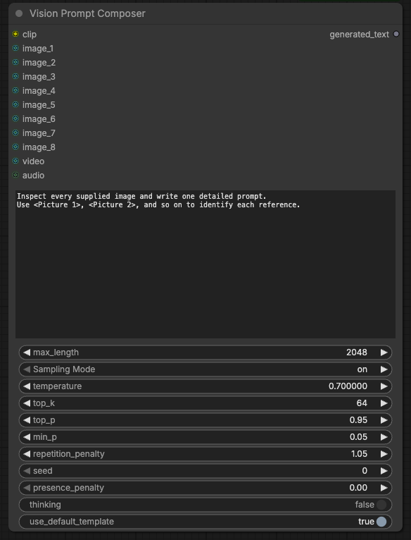

# Vision Prompt Composer

A ComfyUI custom node that generates one text from multiple visual references. It reuses the native `Generate Text` generation logic and sampling schema, replacing its single `image` input with eight optional inputs: `image_1` through `image_8`.



## Usage

1. Connect `CLIPLoader` to `clip` and your text to `prompt`.
2. Connect each `Load Image` node to an image input.
3. Connect `generated_text` to a preview or the node that consumes your prompt.
4. Run the workflow. The model receives all images in one generation call.

You do not need to connect every input. `<Picture N>` numbering follows connected input order, skipping empty inputs. For example, `image_1` and `image_3` become `<Picture 1>` and `<Picture 2>`. For batches, each item receives its own number before moving to the next input. Images retain their dimensions until the model's native preprocessing; this node does not concatenate, resize or combine them into a collage.

Example request:

```text
Mode: Ref2VA
Duration: 8 seconds
Use <Picture 1> as the character reference and <Picture 2> as the environment reference.
Describe both references and place the character in that environment.
Camera: medium shot, static camera.
Audio: quiet ambience, no music, no dialogue.
```

Specify reference roles in your request. Connecting two images does not automatically assign first-frame and last-frame roles. For FL2VA, state these roles explicitly.

## Compatibility

- Designed for a Qwen vision CLIP that supports `images=[...]`; validated with the Qwen tokenizer in ComfyUI 0.34.5.
- Preserves `max_length`, sampling on/off, temperature, top-k/p, min-p, penalties, seed, thinking and template settings from the native node.
- Without images, delegates directly to the native node.
- Preserves the original video and audio inputs; actual support depends on the model. This project's multimodal validation covers images.
- Checks visual payload count and order before generation. A model or template that ignores images produces a clear error instead of a description without access to the references.
- Custom templates need one native visual placeholder per image. The default template is recommended.
- Total reference capacity depends on model memory and context limits. Eight inputs do not impose an eight-frame limit on batches.

## Installation and tests

From the `ComfyUI/custom_nodes` directory, run:

```sh
git clone https://github.com/gabxav/ComfyUI-Vision-Prompt-Composer.git
```

Wait for the queue to finish, restart ComfyUI and refresh your browser. Find **Vision Prompt Composer** in the `text` category. No additional dependencies are required beyond ComfyUI.

If you installed the earlier version in `ComfyUI-MultiImage-Text`, replace that directory with the new installation; do not keep both copies. The internal ID `TextGenerateMultiImage` is preserved for compatibility with existing workflows.

From the ComfyUI root directory, using its Python environment:

```sh
python custom_nodes/ComfyUI-Vision-Prompt-Composer/test_nodes.py --cpu
```

The tests use the real tokenizer without loading model weights. They cover empty inputs, different image sizes, all eight inputs, batches, missing images in custom templates, sampling parameter passthrough, text-only generation and invalid tensors.

## Contributing

Use English for all repository documentation, code, comments, identifiers, interface labels, messages, examples and screenshots. See [AGENTS.md](AGENTS.md). User-provided prompts and dialogue may use any language and must remain unchanged.

## Sources

- [Native Generate Text](https://github.com/Comfy-Org/ComfyUI/blob/master/comfy_extras/nodes_textgen.py)
- [Qwen vision tokenizer](https://github.com/Comfy-Org/ComfyUI/blob/master/comfy/text_encoders/qwen35.py)
